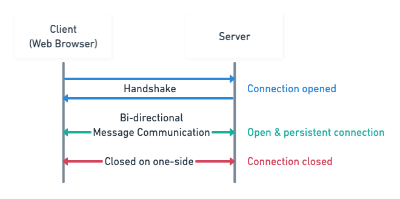
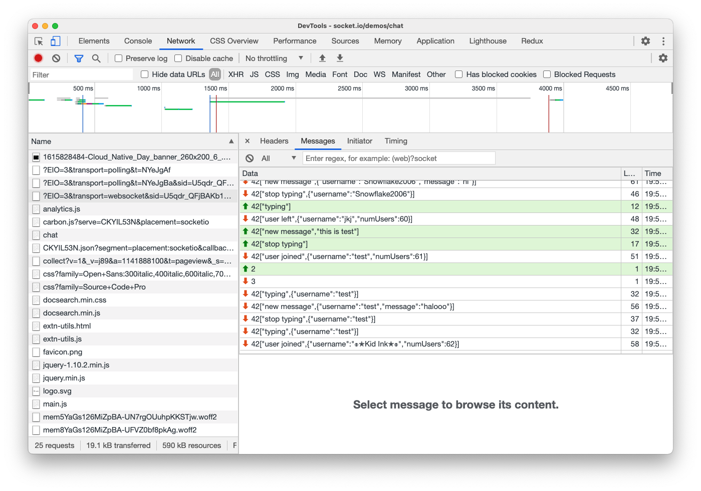

# Introduction to WebSockets

### The Internet protocol suite

__HTTP transaction lifecycle__

[What happens when you type google.com into your browser and press enter?](https://github.com/alex/what-happens-when#http-protocol)

1. Browser uses TCP/IP protocol, provided by the Operating System, to connect to www.google.com server (DNS routing happens here)
2. Browser sends HTTP request to the server using connection made in previous step.
3. Server receives HTTP request.
4. Server interpret HTTP request and respond with HTTP response
5. Browser receives HTTP response.
6. Browser interpret HTTP response (e.g. if it's HTML; render it)

### HTTP: Hyper Text Transfer Protocol

* HTTP is stateless. : After the initial request is done, the server client communication is lost.
* Clients specify actions : GET / POST / PUT / DELETE
* Date sent with headers : Headers sent with request AND response!

Check google dev tool > Headers > General

### AJAX Requests

Asynchronously send data to server without refreshing

### WebSockets

* Full-duplex bi-directional communication
* WebSockets is a HTTP upgrade.
  * Uses the same TCP connection over `ws://` or `wss://`.
* Always prefer encrypted `wss://`
* Easy to implement and standardized.
* Only send headers once.
* If real time updates are not required, don't use WebSockets.

Check browser support : [caniuse.com](https://caniuse.com/websockets)

Websocket Chat Demo : https://socket.io/demos/chat

### Polling & Long polling

* Alternative to WebSockets: Much better backwards compatibility.
* Polling: Send Ajax request every X amount of seconds for new data (not true real time)
* Long Polling: Send request to server and keep connection open until new data

### Server Sent Events

* Another 'real-time' alternative: Uses EventSource API to send messages from server. Not truly bi-directional.
* Generally requires an event loop
* No binary message capability

### Intended use cases

* WebSockets not === replacement for HTTP
  * WS is an upgrade for HTTP.
  * HTTP provides automatic caching.
* Use when you need full-duplex connection
  * Useful for web-based games, chatting applications, low-latency realtime connection

### WebSocket clients

* Used to interface with WebSocket Servers
* Clients exist for MicroPy and Arduino(IoT)
* Most Common client is web based and uses JavaScript
* Require the server to be able to interface WebSocket

### Performance comparison

* HTTP and WebSockets have the same sized header.
* 2 bytes/msg overhead
* SocketIO increases latency and initial connection.
  * Under the hood starts: uses Ajax Long polling initially and then upgrades

#### References

1. [MDN - WebSocket](https://developer.mozilla.org/en-US/docs/Web/API/WebSockets_API)
2. [Javascript.info - WebSocket](https://javascript.info/websocket)
3. [TCP/IP Network Administratio by Craig Hunt](https://www.oreilly.com/library/view/tcpip-network-administration/0596002971/ch01.html)
4. [A Beginner's Guide to WebSockets by Dion Misic](https://www.youtube.com/watch?v=8ARodQ4Wlf4)
5. [What are WebSockets | How is it different from HTTP? by Tech Primers
](https://www.youtube.com/watch?v=i5OVcTdt_OU)
